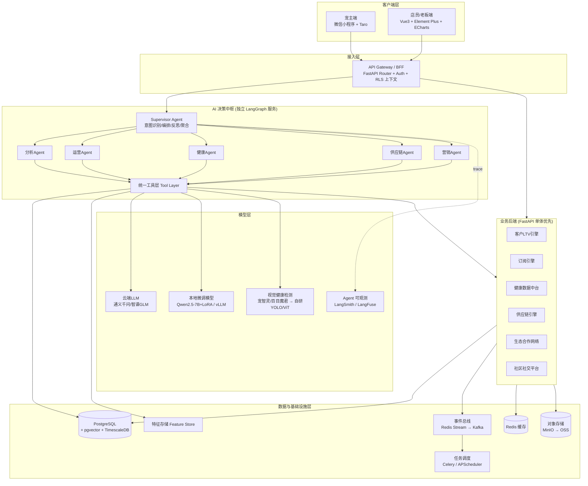
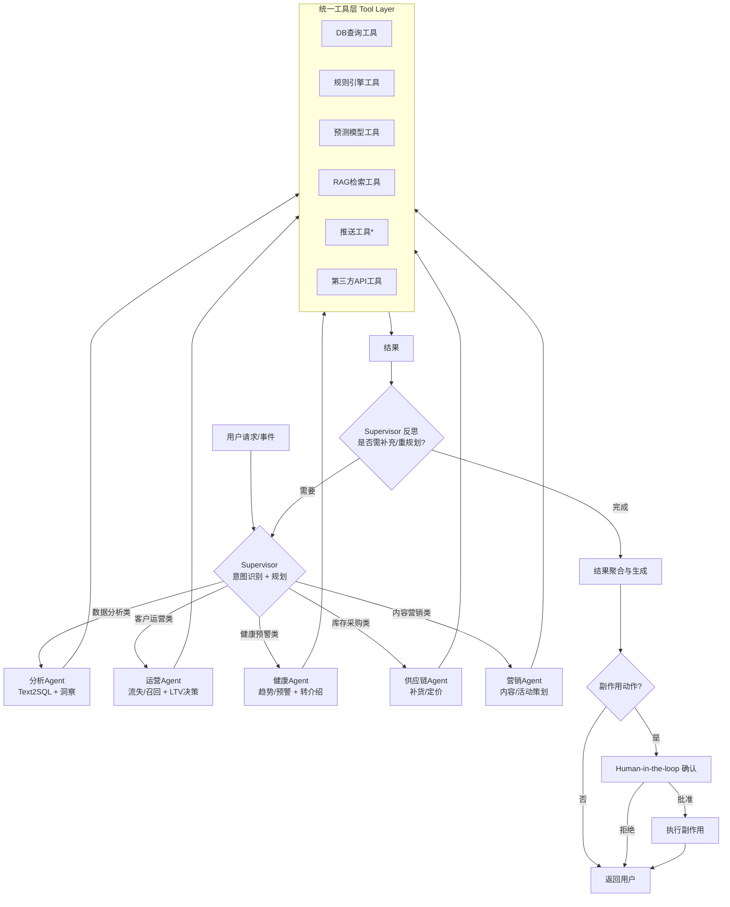
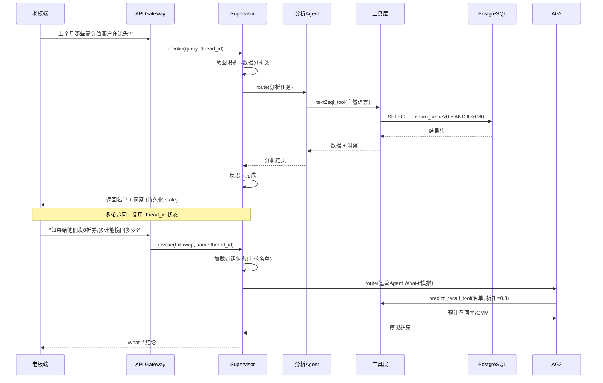
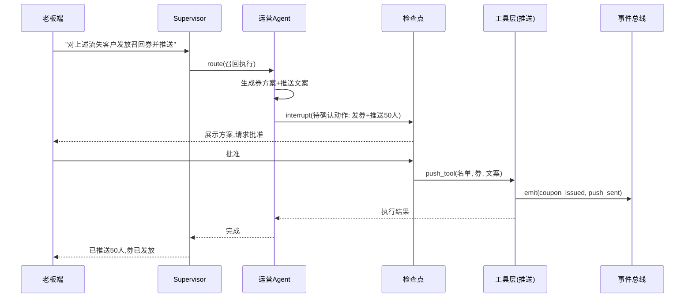
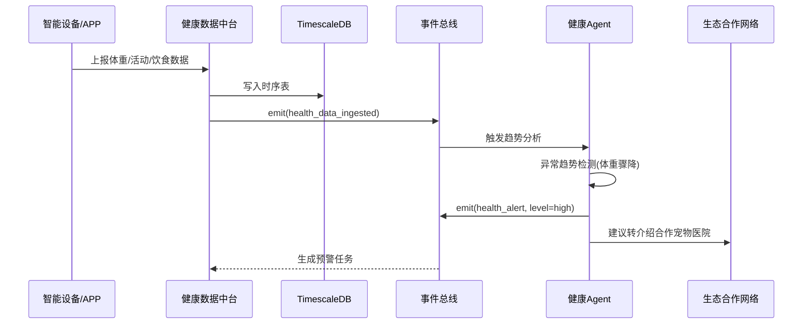
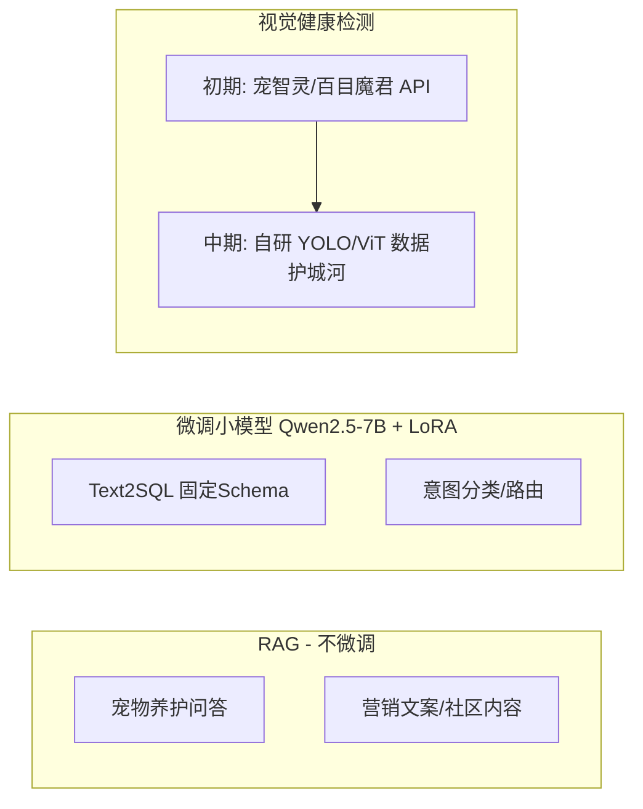
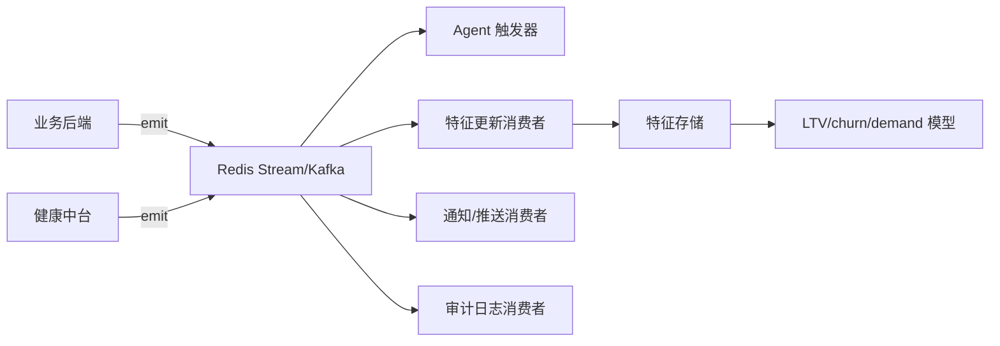
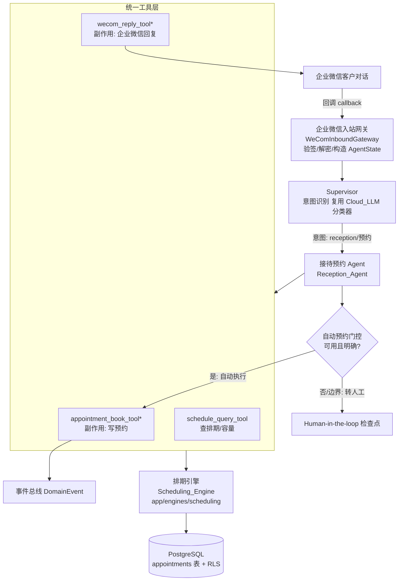

# 设计文档：PetOps 智能宠物店运营大脑平台

## Overview

（概述）


PetOps 是一套面向宠物店的智能运营 SaaS 平台，定位为门店的"运营大脑"。平台在原 v0.1 设计（PetOps-SaaS-20260727）的 7 大业务模块基础上进行智能化架构升级：**客户 LTV 引擎、订阅引擎、健康数据中台、供应链引擎、生态合作网络、社区社交平台、AI 决策中枢**。

本次设计的核心升级是将 **AI 决策中枢重构为基于 LangGraph 的多智能体（Multi-Agent）系统**，采用 Supervisor（主管）+ 专家 Agent 的编排模式，配合统一工具层（Tool Layer）、事件驱动数据架构、以及明确边界的模型微调策略，使 6 个业务引擎从"被动的数据看板"升级为"主动的智能决策与执行"。

平台后端采用 Python FastAPI（MVP 阶段单体优先），Agent 服务作为独立服务通过 API/事件与业务后端通信。数据层采用 PostgreSQL + pgvector + TimescaleDB，事件总线采用 Redis Stream（规模化后演进为 Kafka）。多租户通过 `tenant_id` + PostgreSQL 行级安全（RLS）实现。本文档同时提供高层架构设计（图、组件、接口、数据模型）与底层设计（关键算法伪代码、函数签名、形式化规格）。

---

## Architecture

（系统架构）


### 1.1 总体分层架构



### 1.2 架构关键决策与理由

| 决策 | 选型 | 理由 |
|------|------|------|
| AI 中枢架构 | LangGraph StateGraph 多智能体 | 支持有状态多轮（What-if 分析）、条件路由、反思循环、Human-in-the-loop 检查点 |
| 后端形态 | FastAPI 单体优先 | MVP 阶段降低运维复杂度，模块内高内聚，规模化后按引擎拆分微服务 |
| Agent 服务隔离 | 独立服务，经 API/事件通信 | LLM 调用延迟/失败不阻塞核心交易；可独立扩缩容与灰度 |
| 事件总线 | Redis Stream → Kafka | 单店/MVP 用 Redis Stream 足够，规模化后平滑迁移 Kafka |
| 向量检索 | pgvector（与主库同栈） | 减少组件数量，知识库/历史问答/相似病例共库检索 |
| 多租户隔离 | tenant_id + PostgreSQL RLS | 数据库层强隔离，防止跨租户数据泄露 |
| 副作用动作 | Human-in-the-loop 检查点 | 计费、推送、转介绍等有副作用操作需人工确认 |

### 1.3 AI 决策中枢多智能体拓扑



*注：带副作用的工具（推送 T5、计费、转介绍写入）在 Supervisor 图中被标记为需经 Human-in-the-loop 检查点。

---

## 二、核心业务流程时序图（Sequence Diagrams）

### 2.1 多轮 What-if 分析（有状态对话）



### 2.2 带副作用动作的 Human-in-the-loop 流程



### 2.3 事件驱动的健康预警流程



---

## Components and Interfaces

（组件与接口）


### 组件 1：AI 决策中枢（Supervisor + 专家 Agent）

**职责**：意图识别、任务编排规划、专家 Agent 路由、结果反思与聚合、副作用动作的人机协同控制。

**接口（Python / FastAPI + LangGraph）**：

```python
from typing import TypedDict, Annotated, Literal
from langgraph.graph import StateGraph

class AgentState(TypedDict):
    """LangGraph 全局状态，随 thread_id 持久化，支持多轮。"""
    tenant_id: str                          # 多租户隔离标识
    messages: Annotated[list, "对话历史"]     # 累积式消息
    intent: str | None                      # Supervisor 识别的意图
    plan: list[dict]                        # 任务规划步骤
    agent_outputs: dict[str, dict]          # 各专家 Agent 输出
    pending_action: dict | None             # 待人工确认的副作用动作
    final_answer: str | None                # 聚合后的最终回答

class SupervisorAgent:
    def recognize_intent(self, state: AgentState) -> AgentState: ...
    def route(self, state: AgentState) -> Literal[
        "analysis", "operation", "health", "supply", "marketing", "aggregate"
    ]: ...
    def reflect(self, state: AgentState) -> Literal["replan", "aggregate"]: ...
    def aggregate(self, state: AgentState) -> AgentState: ...

def build_supervisor_graph() -> StateGraph:
    """构建带反思循环与 HITL 检查点的 StateGraph。"""
    ...
```

### 组件 2：专家 Agent 层

**职责**：各领域内的专业分析与决策。每个 Agent 只通过统一工具层访问数据与模型。

```python
class ExpertAgent(Protocol):
    name: str
    def run(self, state: AgentState) -> AgentState: ...

# 5 个专家 Agent
# - AnalysisAgent : Text2SQL + 数据洞察
# - OperationAgent: 流失预测/召回 + LTV 决策
# - HealthAgent   : 健康趋势/预警 + 转介绍建议
# - SupplyAgent   : 补货/安全库存/定价
# - MarketingAgent: 内容/活动策划
```

### 组件 3：统一工具层（Tool Layer）

**职责**：为所有 Agent 提供受控、可审计、租户隔离的能力封装。带副作用工具需经检查点。

```python
from langchain_core.tools import tool

@tool
def db_query_tool(tenant_id: str, natural_language: str) -> dict:
    """自然语言转 SQL 并在租户范围内查询（Text2SQL，微调模型驱动）。"""

@tool
def rules_engine_tool(rule_set: str, context: dict) -> dict:
    """执行业务规则（安全库存、推荐规则等）。"""

@tool
def prediction_tool(model: str, features: dict) -> dict:
    """调用预测模型（churn / LTV / demand）。"""

@tool
def rag_retrieval_tool(tenant_id: str, query: str, top_k: int = 5) -> list[dict]:
    """基于 pgvector 检索知识库/历史问答/相似病例。"""

@tool  # 副作用工具：需 HITL 确认
def push_tool(tenant_id: str, recipients: list[str], template: str, payload: dict) -> dict:
    """企业微信/微信模板消息推送。"""

@tool
def third_party_tool(provider: str, action: str, params: dict) -> dict:
    """第三方 API（视觉检测、支付、医院转介绍等）。"""
```

### 组件 4：业务后端引擎（FastAPI）

```python
# 客户LTV引擎
class LTVEngine:
    def compute_ltv(self, customer_id: str) -> LTVResult: ...
    def segment_customers(self, tenant_id: str) -> list[Segment]: ...

# 订阅引擎
class SubscriptionEngine:
    def create_plan(self, plan: PlanSpec) -> Plan: ...
    def run_billing_cycle(self, tenant_id: str) -> BillingReport: ...

# 健康数据中台
class HealthDataHub:
    def ingest(self, pet_id: str, metrics: HealthMetrics) -> None: ...
    def detect_anomaly(self, pet_id: str) -> list[HealthAlert]: ...

# 供应链引擎
class SupplyChainEngine:
    def forecast_demand(self, sku_id: str) -> DemandForecast: ...
    def safety_stock(self, sku_id: str) -> float: ...

# 生态合作网络 / 社区社交平台
class EcosystemNetwork: ...
class CommunityPlatform: ...
```

---

## Data Models

（数据模型）


### 4.1 多租户与核心实体

```python
from datetime import datetime
from enum import Enum
from pydantic import BaseModel

class Tenant(BaseModel):
    tenant_id: str          # RLS 隔离键
    store_name: str
    plan_tier: str
    created_at: datetime

class Customer(BaseModel):
    customer_id: str
    tenant_id: str
    name: str
    phone: str
    registered_at: datetime
    ltv: float | None = None
    churn_score: float | None = None    # 0-1
    segment: str | None = None          # 高价值/成长/流失风险等

class LifeStage(str, Enum):
    PUPPY = "puppy"          # 幼年
    ADULT = "adult"          # 成年
    SENIOR = "senior"        # 老年

class Pet(BaseModel):
    pet_id: str
    tenant_id: str
    owner_id: str
    species: str             # dog / cat / ...
    breed: str
    birth_date: datetime
    weight_kg: float
    life_stage: LifeStage | None = None
```

**校验规则**：
- `churn_score` ∈ [0, 1]；`ltv` ≥ 0
- `weight_kg` > 0；`birth_date` ≤ 当前时间
- 所有实体必须携带非空 `tenant_id`，写入前经 RLS 上下文校验

### 4.2 时序 / 事件 / 向量数据

```python
class HealthMetric(BaseModel):
    """写入 TimescaleDB 超表（hypertable）。"""
    pet_id: str
    tenant_id: str
    ts: datetime
    weight_kg: float
    activity_minutes: float
    food_intake_g: float

class DomainEvent(BaseModel):
    """事件总线消息（Redis Stream → Kafka）。"""
    event_id: str
    tenant_id: str
    event_type: str          # health_alert / coupon_issued / ...
    payload: dict
    occurred_at: datetime

class KnowledgeChunk(BaseModel):
    """pgvector 存储的知识/问答/病例片段。"""
    chunk_id: str
    tenant_id: str | None    # None 表示平台级共享知识
    content: str
    embedding: list[float]   # pgvector vector 类型
    source_type: str         # care_qa / case / marketing

class FeatureVector(BaseModel):
    """特征存储：LTV/churn/demand 共享特征。"""
    entity_id: str           # customer_id 或 sku_id
    tenant_id: str
    feature_group: str
    features: dict[str, float]
    computed_at: datetime
```

### 4.3 订阅与供应链

```python
class Subscription(BaseModel):
    subscription_id: str
    tenant_id: str
    customer_id: str
    plan_id: str
    status: str              # active / paused / cancelled
    next_billing_at: datetime

class SKU(BaseModel):
    sku_id: str
    tenant_id: str
    name: str
    category: str
    unit_cost: float
    current_stock: float
    lead_time_days: float

class DemandForecast(BaseModel):
    sku_id: str
    horizon_days: int
    predicted_demand: float
    confidence: float
    safety_stock: float
    reorder_point: float
```

---

## 五、微调与模型策略（Fine-tuning Strategy）

明确划分 **RAG（不微调）/ 微调小模型 / 视觉检测** 三条边界，避免过度工程。



| 能力 | 策略 | 技术方案 | 理由 |
|------|------|----------|------|
| 养护问答 | RAG | pgvector + 云端 LLM | 知识频繁更新，检索增强即可 |
| 营销/社区内容 | RAG + Prompt | 云端 LLM（通义/GLM） | 创意生成，无需微调 |
| Text2SQL | 微调 | Qwen2.5-7B + LoRA / LLaMA-Factory / vLLM | Schema 固定、高频、要求准确稳定、降本 |
| 意图分类/路由 | 微调 | 同上 | Supervisor 路由准确性关键，小模型低延迟 |
| 视觉健康检测 | API→自研 | 宠智灵/百目魔君 → YOLO/ViT | 冷启动用 API，积累数据后自研形成护城河 |

**视觉能力抽象层**（便于从第三方 API 平滑切换到自研模型）：

```python
class VisionProvider(Protocol):
    def detect_health(self, image_url: str) -> VisionResult: ...

class ThirdPartyVision(VisionProvider): ...   # 宠智灵 / 百目魔君
class SelfHostedVision(VisionProvider): ...   # 自研 YOLO/ViT

def get_vision_provider(config: dict) -> VisionProvider:
    """按配置返回实现，业务代码不感知底层来源。"""
```

---

## 六、关键算法与形式化规格（Low-Level Design）

### 6.1 生命阶段判定（Life-Stage Judgement）

```python
def judge_life_stage(species: str, breed: str, age_months: float) -> LifeStage:
    """根据物种/品种/月龄判定生命阶段。"""
```

**前置条件（Preconditions）**：
- `species` ∈ 已知物种集合；`age_months` ≥ 0
- 品种体型分级表（size_class）已加载

**后置条件（Postconditions）**：
- 返回值 ∈ {PUPPY, ADULT, SENIOR}
- 大型犬的 SENIOR 阈值早于小型犬（体型越大衰老越早）
- 无副作用

```pascal
ALGORITHM judge_life_stage(species, breed, age_months)
INPUT: species, breed, age_months (>= 0)
OUTPUT: life_stage in {PUPPY, ADULT, SENIOR}
BEGIN
  ASSERT age_months >= 0
  size ← lookup_size_class(species, breed)   // small / medium / large

  puppy_limit ← THRESHOLDS[species][size].puppy_months
  senior_start ← THRESHOLDS[species][size].senior_months

  IF age_months < puppy_limit THEN
    RETURN PUPPY
  ELSE IF age_months < senior_start THEN
    RETURN ADULT
  ELSE
    RETURN SENIOR
  END IF
END
```

### 6.2 流失预测（Churn Prediction）

```python
def predict_churn(features: FeatureVector) -> float:
    """输出客户流失概率 ∈ [0,1]。"""
```

**前置条件**：`features` 包含 RFM 与行为特征且非空
**后置条件**：返回值 ∈ [0, 1]；特征全为"活跃"时分数单调偏低（单调性约束）；纯函数无副作用
**循环不变式**：特征归一化循环中，已处理特征均落在 [0,1]

```pascal
ALGORITHM predict_churn(features)
INPUT: features (RFM + 行为)
OUTPUT: churn_score in [0, 1]
BEGIN
  ASSERT features != NULL

  FOR each f IN features.items DO
    ASSERT all_normalized(processed)          // 循环不变式
    processed[f] ← normalize(f, feature_stats[f])
  END FOR

  // MVP: 加权逻辑回归/GBDT；共享 Feature Store 特征
  raw ← model.predict(processed)
  score ← clamp(raw, 0.0, 1.0)

  ASSERT 0.0 <= score AND score <= 1.0
  RETURN score
END
```

### 6.3 LTV 预测（Customer Lifetime Value）

```python
def predict_ltv(customer_id: str, horizon_months: int = 24) -> float:
    """预测未来 horizon_months 内的客户净价值。"""
```

**前置条件**：`horizon_months` > 0；客户交易历史可获取
**后置条件**：返回值 ≥ 0；`horizon_months` 增大时 LTV 单调不减（同一客户）

```pascal
ALGORITHM predict_ltv(customer_id, horizon_months)
INPUT: customer_id, horizon_months (> 0)
OUTPUT: ltv (>= 0)
BEGIN
  ASSERT horizon_months > 0
  f ← feature_store.get(customer_id)

  purchase_freq ← f.avg_monthly_orders
  avg_value ← f.avg_order_value
  retain_prob ← 1.0 - predict_churn(f)       // 复用流失模型

  ltv ← 0.0
  FOR m ← 1 TO horizon_months DO
    ASSERT ltv >= 0                           // 循环不变式
    survival ← retain_prob ^ m
    ltv ← ltv + purchase_freq * avg_value * survival * discount_factor(m)
  END FOR

  ASSERT ltv >= 0
  RETURN ltv
END
```

### 6.4 需求预测（Demand Forecast）

```python
def forecast_demand(sku_id: str, horizon_days: int) -> DemandForecast:
    """基于历史销量时序预测未来需求。"""
```

**前置条件**：`horizon_days` > 0；SKU 至少有最小历史窗口数据
**后置条件**：`predicted_demand` ≥ 0；`confidence` ∈ [0,1]

```pascal
ALGORITHM forecast_demand(sku_id, horizon_days)
INPUT: sku_id, horizon_days (> 0)
OUTPUT: DemandForecast
BEGIN
  ASSERT horizon_days > 0
  series ← timescaledb.query_sales(sku_id, window=90d)

  IF length(series) < MIN_HISTORY THEN
    RETURN fallback_moving_average(series, horizon_days)
  END IF

  // 季节性 + 趋势 (如 Prophet / 加权移动平均)
  demand ← seasonal_trend_model(series, horizon_days)
  demand ← max(demand, 0.0)
  conf ← estimate_confidence(series)

  ASSERT demand >= 0 AND 0 <= conf AND conf <= 1
  RETURN DemandForecast(sku_id, horizon_days, demand, conf)
END
```

### 6.5 安全库存与再订货点（Safety Stock）

```python
def safety_stock(sku_id: str, service_level: float = 0.95) -> float:
    """计算安全库存量。"""
```

**前置条件**：`service_level` ∈ (0,1)；`lead_time_days` > 0；需求标准差 ≥ 0
**后置条件**：返回值 ≥ 0；`service_level` 越高安全库存越大（单调递增）

```pascal
ALGORITHM safety_stock(sku_id, service_level)
INPUT: sku_id, service_level in (0,1)
OUTPUT: ss (>= 0)
BEGIN
  ASSERT 0 < service_level AND service_level < 1
  sku ← get_sku(sku_id)
  ASSERT sku.lead_time_days > 0

  z ← inverse_normal_cdf(service_level)      // 服务水平对应 z 值
  sigma_d ← demand_std(sku_id)               // 需求标准差
  L ← sku.lead_time_days

  ss ← z * sigma_d * sqrt(L)
  ss ← max(ss, 0.0)

  reorder_point ← avg_daily_demand(sku_id) * L + ss

  ASSERT ss >= 0
  RETURN ss
END
```

### 6.6 推荐规则引擎（Recommendation Rules）

```python
def recommend(customer_id: str, context: dict) -> list[Recommendation]:
    """结合生命阶段/健康/流失/库存生成推荐（规则 + 模型混合）。"""
```

**前置条件**：客户存在且属于当前租户
**后置条件**：返回列表按 `score` 降序；每条推荐附带可解释理由 `reason`；不推荐缺货 SKU

```pascal
ALGORITHM recommend(customer_id, context)
INPUT: customer_id, context
OUTPUT: recommendations (按 score 降序)
BEGIN
  ASSERT belongs_to_tenant(customer_id, context.tenant_id)
  pets ← get_pets(customer_id)
  candidates ← []

  FOR each pet IN pets DO
    stage ← judge_life_stage(pet.species, pet.breed, pet.age_months)
    // 规则层：按生命阶段/健康预警匹配品类
    rule_items ← rules_engine("recommend", {stage, pet.health_alerts})
    FOR each item IN rule_items DO
      IF item.in_stock THEN                  // 不推荐缺货
        score ← rank_model(customer_id, item)
        candidates.append({item, score, reason: explain(stage, item)})
      END IF
    END FOR
  END FOR

  sorted ← sort_desc(candidates, key=score)
  ASSERT is_sorted_desc(sorted)
  RETURN sorted
END
```

### 6.7 Supervisor 编排主循环（含反思与 HITL）

```pascal
ALGORITHM supervisor_run(state)
INPUT: state (AgentState, 携带 tenant_id 与对话历史)
OUTPUT: state (含 final_answer)
BEGIN
  ASSERT state.tenant_id != NULL

  state.intent ← classify_intent(state.messages)   // 微调意图模型
  state.plan ← plan_tasks(state.intent)

  LOOP
    next ← route(state)                             // 选择专家 Agent 或聚合
    IF next = "aggregate" THEN BREAK

    agent ← EXPERT_AGENTS[next]
    output ← agent.run(state)                       // 仅经工具层访问数据
    state.agent_outputs[next] ← output

    decision ← reflect(state)                       // 反思: 是否重规划
    IF decision = "aggregate" THEN BREAK
  END LOOP

  state.final_answer ← aggregate(state.agent_outputs)

  IF has_side_effect(state.plan) THEN               // 副作用: HITL 检查点
    state.pending_action ← extract_action(state)
    INTERRUPT_FOR_HUMAN_APPROVAL(state.pending_action)
  END IF

  ASSERT state.final_answer != NULL
  RETURN state
END
```

---

## 七、事件驱动数据架构（Event-Driven Data Architecture）

### 7.1 事件流



**关键事件类型**：`health_data_ingested`、`health_alert`、`coupon_issued`、`push_sent`、`subscription_billed`、`order_placed`、`stock_low`。

### 7.2 特征存储共享

LTV / churn / demand 三类模型共享同一 Feature Store，避免重复计算与训练-服务偏斜（training-serving skew）：

```python
class FeatureStore:
    def write(self, fv: FeatureVector) -> None: ...
    def get(self, entity_id: str, feature_group: str) -> FeatureVector: ...
    def get_online(self, entity_id: str) -> dict[str, float]:
        """低延迟在线特征（Redis 支撑），供实时推理。"""
```

---

## 八、示例用法（Example Usage）

```python
# 示例 1：老板端自然语言分析（多轮 What-if）
graph = build_supervisor_graph()
config = {"configurable": {"thread_id": "boss-session-001"}}

state = graph.invoke(
    {"tenant_id": "store_88", "messages": [("user", "上个月哪些高价值客户在流失?")]},
    config=config,
)
print(state["final_answer"])

# 追问（复用 thread_id，命中持久化状态）
state = graph.invoke(
    {"messages": [("user", "如果给他们发8折券,预计能挽回多少?")]},
    config=config,
)

# 示例 2：供应链补货决策
forecast = supply_engine.forecast_demand("sku_dogfood_2kg", horizon_days=14)
ss = supply_engine.safety_stock("sku_dogfood_2kg", service_level=0.95)
if forecast.predicted_demand + ss > sku.current_stock:
    print("需补货")

# 示例 3：带副作用动作，触发 HITL
state = graph.invoke(
    {"tenant_id": "store_88",
     "messages": [("user", "对上述流失客户发放召回券并推送")]},
    config=config,
)
# graph 在 push 前 interrupt，等待老板批准后再执行
```

---

## 十四、企业微信智能客服与自动预约排期（WeCom 智能客服 + 自动预约排期）

（本节为新增模块，无缝接入既有 AI 决策中枢与工具层，不改动上文任何既有组件与约束。）

### 14.1 模块概述

宠主通过**企业微信**与门店对话，用自然语言表达洗护预约意图（如"想约周六下午给我家狗狗洗澡"）。系统流程：

1. **理解预约意图**：由 **Cloud_LLM（通义千问 / 智谱 GLM）结合提示工程 / 少样本**从对话中抽取预约槽位（服务类型、目标宠物、期望时间/时段）。**沿用本次范围约束：仅提示工程 / 少样本，不做模型微调。**
2. **查询排期与容量**：查询该门店在目标时段的洗护排期与容量（营业时间 + 每时段洗护工位/店员数 − 已有预约）。
3. **命中空档 → 自动预约**：若目标时段有可用容量且意图明确、置信度达标，则**自动写入预约**并经企业微信回复确认。
4. **满档 → 回复现状 + 建议**：若目标时段已满，则回复当前排期占用情况，并给出最近的 N 个可用备选时段建议（优先当天，其次后续日期）。

该模块是**企业微信入站消息**驱动的一条新交互链路：入站回调 → AI 决策中枢（Supervisor）→ 新增**接待预约 Agent（Reception_Agent）**→ 新增**排期引擎（Scheduling_Engine）**工具 → 经企业微信出站回复。

### 14.2 架构定位与既有组件复用



**明确复用的既有组件（不重复造轮子）**：

| 既有组件 | 复用方式 |
|----------|----------|
| Supervisor 意图识别（Cloud_LLM 分类器） | 新增 `reception`（预约接待）意图分类，路由到 Reception_Agent |
| 统一工具层 Tool Layer + RLS 注入 | 新增预约相关工具，全部经既有 `tenant_id` 强制注入与结果集租户校验 |
| 专家 Agent 协议 `ExpertAgent`（`name` + `run(state)`） | Reception_Agent 遵循同一协议，产出 `agent_outputs[name]` 状态增量 |
| 事件总线 `DomainEvent` + 四类消费者扇出 | 新增预约相关事件类型经既有总线发布 |
| Human-in-the-loop 检查点 | 边界/歧义预约动作沿用既有 HITL `pending_action` 中断/恢复机制 |
| 可观测 Observability（LangSmith/LangFuse） | 预约决策链沿用既有全链路 trace |
| 推送/通知路径（`push_tool` 企业微信通道） | 出站回复 `wecom_reply_tool` 扩展自既有企业微信推送通道 |

### 14.3 组件与接口（Python 签名）

#### 组件 A：企业微信入站网关（WeCom Inbound Gateway）

**职责**：接收企业微信回调、验签/解密、还原客户消息，构造 `AgentState`（注入 `tenant_id`、`thread_id` 复用会话），调用 Supervisor。

```python
from typing import Protocol

class WeComInboundMessage(BaseModel):
    """企业微信入站消息（解密后）。"""
    tenant_id: str                  # 由企业微信 corp/agent 映射到门店租户
    external_user_id: str           # 企业微信客户标识（外部联系人）
    customer_id: str | None         # 映射到平台 Customer（可能需绑定）
    content: str                    # 客户自然语言文本
    msg_id: str                     # 幂等去重键
    received_at: datetime

class WeComInboundGateway(Protocol):
    def verify_signature(self, raw: dict) -> bool: ...
    def decode(self, raw: dict) -> WeComInboundMessage: ...
    def handle(self, raw: dict) -> str:
        """验签→解密→构造 AgentState（含 tenant_id/thread_id）→ invoke Supervisor→ 出站回复。
        返回回复文本（同时经 wecom_reply_tool 推送给客户）。"""
```

#### 组件 B：接待预约 Agent（Reception_Agent，新增专家 Agent）

**职责**：从对话抽取预约意图（Cloud_LLM few-shot），调用排期引擎工具判定可用性，按门控策略自动预约或转 HITL，生成面向客户的企业微信回复文案（满档时附备选建议）。仅经工具层/引擎访问数据。

```python
class ReceptionAgent:
    name = "reception"

    def __init__(self, llm_client, scheduling_engine: "SchedulingEngine",
                 *, auto_book_enabled: bool = True,
                 intent_confidence_threshold: float = 0.7,
                 suggestion_count: int = 3) -> None: ...

    def run(self, state: AgentState) -> AgentState:
        """遵循 ExpertAgent 协议，返回状态增量（plan/agent_outputs[reception]）。"""

    def parse_booking_intent(self, text: str, tenant_id: str) -> "BookingIntent":
        """经 Cloud_LLM 提示工程/少样本抽取预约槽位（不微调）。"""

    def handle_booking(self, intent: "BookingIntent", state: AgentState) -> "BookingOutcome":
        """判定可用性→自动预约 / 满档建议 / 转 HITL / 请澄清。"""
```

#### 组件 C：排期引擎（Scheduling_Engine，`app/engines/scheduling`）

**职责**：容量/时段模型的权威来源。判定时段可用性、原子化写入预约（绝不超容量）、满档时给出备选时段、查询某日排期。

```python
class SchedulingEngine:
    def get_day_schedule(self, tenant_id: str, service_type: "ServiceType",
                         day: date) -> list["TimeSlot"]:
        """返回某营业日各时段的容量与已订数（用于回复现状）。"""

    def check_availability(self, tenant_id: str, service_type: "ServiceType",
                           start_at: datetime, end_at: datetime) -> "SlotAvailability":
        """检查目标时段是否在营业时间内且有剩余容量。"""

    def book_appointment(self, req: "BookingRequest") -> "Appointment":
        """原子预约：在同一事务内校验容量并写入，保证 booked_count ≤ capacity。
        超容量/越营业时间/租户越权时抛领域错误，绝不产生部分写入。"""

    def suggest_alternatives(self, tenant_id: str, service_type: "ServiceType",
                             requested_start: datetime, n: int = 3,
                             search_horizon_days: int = 7) -> list["TimeSlot"]:
        """满档时返回按"距期望时间就近"排序的最多 n 个真实可用备选时段。"""
```

#### 组件 D：预约相关工具（Tool Layer 扩展）

```python
@tool
def schedule_query_tool(tenant_id: str, service_type: str, day: str) -> dict:
    """查询某日排期与容量（只读，经 RLS 注入 tenant_id）。"""

@tool  # 副作用工具：可自动执行（门控见 14.6）或经 HITL 确认
def appointment_book_tool(tenant_id: str, req: dict) -> dict:
    """原子写入预约（经 Scheduling_Engine.book_appointment）。"""

@tool  # 副作用工具：企业微信出站回复（扩展自既有 push_tool 企业微信通道）
def wecom_reply_tool(tenant_id: str, external_user_id: str, text: str) -> dict:
    """经企业微信通道向客户回复文本消息。"""
```

### 14.4 数据模型（Data Models）

```python
class ServiceType(str, Enum):
    GROOMING = "grooming"        # 洗护 / 洗澡（本模块主场景）
    MEDICAL_BATH = "medical_bath"
    # 预留其它可预约服务类型

class AppointmentStatus(str, Enum):
    PENDING = "pending"          # 待确认（转 HITL 时）
    CONFIRMED = "confirmed"      # 已确认（自动或人工批准后）
    CANCELLED = "cancelled"
    COMPLETED = "completed"

class BusinessHours(BaseModel):
    """门店营业时间（按星期）。"""
    tenant_id: str
    weekday: int                 # 0=周一 … 6=周日
    open_time: time              # 当日开始
    close_time: time             # 当日结束（open < close）

class GroomingResource(BaseModel):
    """洗护资源（工位/店员），容量 = 同一时段可并行服务的资源数。"""
    resource_id: str
    tenant_id: str
    name: str
    service_type: ServiceType
    active: bool = True

class TimeSlot(BaseModel):
    """一个时段的容量视图。"""
    tenant_id: str
    service_type: ServiceType
    start_at: datetime
    end_at: datetime             # start_at < end_at
    capacity: int                # 该时段容量（资源数）, ≥ 0
    booked_count: int            # 已订数, 0 ≤ booked_count ≤ capacity
    @property
    def available(self) -> int:  # 剩余容量 = capacity - booked_count, ≥ 0
        return max(self.capacity - self.booked_count, 0)

class Appointment(BaseModel):
    """预约记录（写入 appointments 表，启用 RLS）。"""
    appointment_id: str
    tenant_id: str               # RLS 隔离键, 非空
    customer_id: str
    pet_id: str
    service_type: ServiceType
    start_at: datetime
    end_at: datetime             # start_at < end_at
    resource_id: str | None      # 分配的工位/店员
    status: AppointmentStatus
    source: str = "wecom"        # 来源渠道
    created_at: datetime

class BookingIntent(BaseModel):
    """Cloud_LLM 从对话抽取的预约意图（NLU 输出）。"""
    service_type: ServiceType | None
    pet_ref: str | None          # 客户对宠物的指代（"我家狗狗"）
    pet_id: str | None           # 消解后的宠物标识
    requested_start: datetime | None
    requested_end: datetime | None
    confidence: float            # ∈ [0,1]
    ambiguous: bool              # 槽位不完整/歧义（多宠物、时间模糊等）

class BookingRequest(BaseModel):
    tenant_id: str
    customer_id: str
    pet_id: str
    service_type: ServiceType
    start_at: datetime
    end_at: datetime

class BookingOutcome(BaseModel):
    """接待预约 Agent 的处理结果。"""
    status: str                  # booked / full / needs_hitl / needs_clarification / rejected
    appointment: Appointment | None = None
    alternatives: list[TimeSlot] = []      # 满档时的备选建议
    current_schedule: list[TimeSlot] = []  # 满档时回复的排期现状
    reply_text: str              # 面向客户的企业微信回复文案
```

**校验规则**：
- 所有实体携带非空 `tenant_id`（经既有 RLS 上下文校验，复用 Property 1）。
- `TimeSlot`：`capacity ≥ 0`、`0 ≤ booked_count ≤ capacity`、`start_at < end_at`。
- `Appointment`：`start_at < end_at`；`status ∈ AppointmentStatus`。
- `BusinessHours`：`open_time < close_time`。
- `BookingIntent.confidence ∈ [0, 1]`。

### 14.5 企业微信预约流程时序图（可用 + 满档两种情形）

```mermaid
sequenceDiagram
    participant C as 客户(企业微信)
    participant GW as 企业微信入站网关
    participant SUP as Supervisor
    participant RA as Reception_Agent
    participant SE as 排期引擎
    participant DB as PostgreSQL(RLS)
    participant BUS as 事件总线

    C->>GW: "想约周六下午给狗狗洗澡"
    GW->>GW: 验签/解密, 构造 AgentState(tenant_id, thread_id)
    GW->>SUP: invoke(消息)
    SUP->>SUP: 意图识别→reception(Cloud_LLM 分类)
    SUP->>RA: route(预约接待)
    RA->>RA: parse_booking_intent (Cloud_LLM few-shot)
    RA->>SE: check_availability(周六 14:00-15:00, grooming)

    alt 时段可用 且 意图明确 且 置信度达标 且 auto_book 开启
        SE-->>RA: available > 0
        RA->>SE: book_appointment(原子: 校验容量+写入)
        SE->>DB: BEGIN; SELECT ... FOR UPDATE; INSERT; COMMIT
        DB-->>SE: Appointment(confirmed)
        SE->>BUS: emit(appointment_booked)
        SE-->>RA: 预约成功
        RA->>GW: reply "已为您预约周六14:00洗护, 到店见~"
        GW->>C: 企业微信回复(确认)
    else 时段满档
        SE-->>RA: available = 0
        RA->>SE: get_day_schedule + suggest_alternatives(n=3)
        SE-->>RA: 当日排期现状 + 最近可用备选
        SE->>BUS: emit(appointment_rejected_full)
        RA->>GW: reply "周六14:00已约满, 现有排期…; 可选: 周六16:00/周日10:00/周日14:00"
        GW->>C: 企业微信回复(现状+备选建议)
    else 意图歧义/边界(多宠物/时间模糊/低置信度)
        RA->>SUP: 置 pending_action → HITL 检查点(转人工确认)
        Note over SUP,C: 沿用既有 HITL 机制, 人工确认后再执行或请客户澄清
    end
```

### 14.6 自动预约门控策略（Auto-Booking Gating / HITL 边界）

客户明确希望**空档即自动预约**，故对"已确认可用时段"的预约允许**自动执行**（可配置）；而歧义/边界场景路由到既有 HITL 检查点，避免误订。判定函数：

```pascal
FUNCTION should_auto_book(intent, availability, config)
BEGIN
  IF NOT config.auto_book_enabled THEN RETURN NEEDS_HITL      // 租户可关闭自动预约
  IF intent.ambiguous THEN RETURN NEEDS_CLARIFICATION_OR_HITL // 多宠物/服务不清/时间模糊
  IF intent.confidence < config.threshold THEN RETURN NEEDS_HITL
  IF intent.service_type = NULL OR intent.pet_id = NULL
     OR intent.requested_start = NULL THEN RETURN NEEDS_CLARIFICATION
  IF availability.available <= 0 THEN RETURN FULL_SUGGEST      // 满档→回复现状+备选
  RETURN AUTO_BOOK                                             // 可用且明确→自动预约
END
```

**门控原则（写入设计约束）**：
- **仅当**（时段确有剩余容量）**且**（意图无歧义：服务类型 = 洗护、目标宠物已消解、时间已解析）**且**（置信度 ≥ 阈值）**且**（租户开启 `auto_book_enabled`）时，`appointment_book_tool` 才**自动执行**（无需人工）。
- 否则一律降级：满档 → 回复现状 + 备选建议；歧义/低置信 → 请客户澄清或转 **HITL 检查点**（复用既有 `pending_action` 中断/恢复）。
- 该策略与 Property 8（副作用需批准）**不冲突**：Property 8 约束的是**需要人工确认**的副作用；本模块将"已确认可用且明确的自动预约"定义为**可自动执行的白名单副作用**，其余仍走 HITL。此边界在 14.6 显式声明。

### 14.7 关键算法与形式化规格（Low-Level Design）

#### 14.7.1 预约意图抽取 `parse_booking_intent`

**前置条件**：`text` 非空；`tenant_id` 非空（经 RLS 校验）。
**后置条件**：返回 `BookingIntent`，`confidence ∈ [0,1]`；无法解析出具体时间/宠物/服务时 `ambiguous = True`；纯读取、无副作用（不写库）。

```pascal
ALGORITHM parse_booking_intent(text, tenant_id)
INPUT: text (非空), tenant_id (非空)
OUTPUT: BookingIntent (confidence ∈ [0,1])
BEGIN
  ASSERT text != "" AND tenant_id != NULL
  // 云端 LLM few-shot 抽取（不微调），返回结构化槽位
  slots ← cloud_llm.extract_booking_slots(text)   // service_type/时间/宠物指代/置信度
  intent.service_type ← slots.service_type
  intent.requested_start, intent.requested_end ← normalize_time(slots.time, now())
  intent.pet_id ← resolve_pet(tenant_id, slots.pet_ref)   // 经工具层, RLS 内消解
  intent.confidence ← clamp(slots.confidence, 0.0, 1.0)
  intent.ambiguous ← (intent.service_type = NULL)
                     OR (intent.requested_start = NULL)
                     OR (intent.pet_id = NULL AND multiple_pets(tenant_id, customer))
  ASSERT 0.0 <= intent.confidence AND intent.confidence <= 1.0
  RETURN intent
END
```

#### 14.7.2 可用性检查 `check_availability`

**前置条件**：`start_at < end_at`；`tenant_id` 非空。
**后置条件**：`available = max(capacity - booked_count, 0) ≥ 0`；`in_business_hours` 反映时段是否完全落在营业时间内。

```pascal
ALGORITHM check_availability(tenant_id, service_type, start_at, end_at)
INPUT: tenant_id, service_type, start_at < end_at
OUTPUT: SlotAvailability{available >= 0, in_business_hours}
BEGIN
  ASSERT start_at < end_at
  hours ← get_business_hours(tenant_id, weekday_of(start_at))
  in_hours ← (hours != NULL)
             AND time_of(start_at) >= hours.open_time
             AND time_of(end_at)   <= hours.close_time
  capacity ← count_active_resources(tenant_id, service_type)          // 工位/店员数
  booked ← count_overlapping_appointments(tenant_id, service_type,     // RLS 内计数
                                          start_at, end_at,
                                          status IN {PENDING, CONFIRMED})
  available ← max(capacity - booked, 0)
  ASSERT available >= 0
  RETURN {available, in_business_hours: in_hours, capacity, booked}
END
```

#### 14.7.3 原子预约 `book_appointment`（防双重预订）

**前置条件**：`start_at < end_at`；`req.tenant_id` = 上下文 `tenant_id`（非空）。
**后置条件**：成功则新增一条 `CONFIRMED`（或 `PENDING`）预约且**该时段 `booked_count ≤ capacity` 始终成立**；营业时间外/超容量/租户越权则抛错且**无任何写入**（原子性）。
**关键不变式**：并发写入下，对同一 (tenant, service_type, 重叠时段) 的确认预约数 `≤ capacity`。

```pascal
ALGORITHM book_appointment(req)
INPUT: req (BookingRequest, req.start_at < req.end_at)
OUTPUT: Appointment
BEGIN
  ASSERT req.start_at < req.end_at
  ASSERT req.tenant_id = context.tenant_id AND req.tenant_id != NULL   // 租户隔离(Property 1)

  BEGIN TRANSACTION
    // 对该 (tenant, service_type, 时段) 的容量行加行级锁, 串行化并发预约
    LOCK slot_capacity_row(req.tenant_id, req.service_type, req.start_at) FOR UPDATE

    avail ← check_availability(req.tenant_id, req.service_type,
                               req.start_at, req.end_at)
    IF NOT avail.in_business_hours THEN
      ROLLBACK; RAISE OutOfBusinessHoursError            // 无写入
    IF avail.available <= 0 THEN
      ROLLBACK; RAISE SlotFullError                       // 无写入(交由满档建议)

    appt ← INSERT Appointment(status = CONFIRMED, source = "wecom", ...)
    ASSERT count_confirmed_in_slot(...) <= avail.capacity  // 不变式: 绝不超容量
  COMMIT

  emit(DomainEvent("appointment_booked", {appointment_id, tenant_id, ...}))
  RETURN appt
END
```

> 并发安全实现要点：以 (tenant_id, service_type, 时段) 的容量行 `SELECT … FOR UPDATE` 行级锁串行化同槽并发预约；配合数据库唯一/排他约束（如按 `resource_id + 重叠时段` 的排他约束）双保险，确保"检查—写入"原子，杜绝超卖。

#### 14.7.4 备选时段建议 `suggest_alternatives`

**前置条件**：`n > 0`；`search_horizon_days > 0`；`tenant_id` 非空。
**后置条件**：返回**至多 n** 个时段，**每个返回时段 `available > 0` 且完全落在营业时间内**（即真实可用）；结果按"与 `requested_start` 的时间距离升序"排列（同天优先，其次后续日期）；无可用时返回空列表。

```pascal
ALGORITHM suggest_alternatives(tenant_id, service_type, requested_start, n, horizon)
INPUT: tenant_id, service_type, requested_start, n > 0, horizon > 0
OUTPUT: list<TimeSlot> (长度 <= n, 每个 available > 0 且在营业时间内)
BEGIN
  candidates ← []
  FOR day ← date(requested_start) TO date(requested_start) + horizon DO
    slots ← enumerate_business_slots(tenant_id, service_type, day)   // 仅营业时间内
    FOR each s IN slots DO
      avail ← check_availability(tenant_id, service_type, s.start_at, s.end_at)
      IF avail.in_business_hours AND avail.available > 0 THEN
        candidates.append(s WITH booked_count, capacity)
      END IF
    END FOR
  END FOR
  // 按与期望时间的接近度排序: 同天优先, 再按 |start - requested_start| 升序
  sorted ← sort_asc(candidates, key = proximity(s.start_at, requested_start))
  result ← take(sorted, n)
  ASSERT ∀ s IN result: s.available > 0 AND in_business_hours(s)     // 后置条件
  RETURN result
END
```

#### 14.7.5 接待预约主流程 `handle_booking`（编排）

```pascal
ALGORITHM handle_booking(intent, state)
INPUT: intent (BookingIntent), state (AgentState, 携带 tenant_id)
OUTPUT: BookingOutcome
BEGIN
  ASSERT state.tenant_id != NULL
  decision ← should_auto_book(intent, availability?, config)   // 见 14.6

  CASE decision OF
    NEEDS_CLARIFICATION:
      RETURN {status:"needs_clarification", reply_text: ask_missing_slots(intent)}
    NEEDS_HITL:
      state.pending_action ← build_booking_action(intent)      // 复用既有 HITL
      RETURN {status:"needs_hitl", reply_text: "已转人工为您确认预约"}
    FULL_SUGGEST:
      sched ← get_day_schedule(tenant_id, intent.service_type, date(intent.start))
      alts  ← suggest_alternatives(tenant_id, intent.service_type,
                                   intent.requested_start, config.suggestion_count)
      RETURN {status:"full", current_schedule: sched, alternatives: alts,
              reply_text: render_full_reply(sched, alts)}
    AUTO_BOOK:
      appt ← book_appointment(to_request(intent, state))       // 原子写入
      RETURN {status:"booked", appointment: appt,
              reply_text: render_confirm_reply(appt)}
  END CASE
END
```

### 14.8 新增事件类型（复用既有事件总线）

经既有 `DomainEvent` 与四类消费者扇出发布：

| 事件类型 | 触发时机 | 载荷要点 |
|----------|----------|----------|
| `appointment_requested` | 入站解析出预约意图 | tenant_id, customer_id, intent 摘要 |
| `appointment_booked` | 自动/人工确认预约写入成功 | appointment_id, tenant_id, start_at, resource_id |
| `appointment_rejected_full` | 目标时段满档 | tenant_id, requested_start, 备选摘要 |
| `wecom_reply_sent` | 企业微信出站回复已发送 | tenant_id, external_user_id, 回复类型 |

---

## Correctness Properties

（正确性属性）


以下属性以全称量化陈述，供后续需求推导与属性测试使用：

### Property 1: 租户隔离（Tenant Isolation）
∀ 查询 q，其结果集中每条记录的 `tenant_id` 必等于请求上下文的 `tenant_id`（RLS 保证跨租户零泄露）。

**Validates: Requirements 1.5, 2.1, 5.1, 5.2, 5.3, 13.4**

### Property 2: 流失分数有界（Churn Score Bounded）
∀ 客户 c，`predict_churn(c)` ∈ [0, 1]。

**Validates: Requirements 7.1, 7.2**

### Property 3: LTV 非负与单调（LTV Non-negative & Monotonic）
∀ 客户 c 与 h₁ < h₂，`predict_ltv(c, h₁)` ≤ `predict_ltv(c, h₂)` 且均 ≥ 0。

**Validates: Requirements 6.1, 6.2**

### Property 4: 生命阶段完备性（Life-Stage Totality）
∀ (species, breed, age≥0)，`judge_life_stage` 必返回三值之一，且大型犬 SENIOR 阈值 ≤ 小型犬。

**Validates: Requirements 10.1, 10.2**

### Property 5: 安全库存单调性（Safety Stock Monotonicity）
∀ SKU，`service_level` 增大时 `safety_stock` 不减，且恒 ≥ 0。

**Validates: Requirements 12.1, 12.2**

### Property 6: 需求预测非负（Demand Forecast Non-negative）
∀ SKU 与 horizon>0，`forecast_demand` 的 `predicted_demand` ≥ 0 且 `confidence` ∈ [0,1]。

**Validates: Requirements 11.1**

### Property 7: 推荐有序且有货（Recommendation Ordered & In-stock）
`recommend` 返回列表按 score 降序，且不含缺货 SKU，且每条附可解释理由。

**Validates: Requirements 13.1, 13.2, 13.3**

### Property 8: 副作用需批准（Side-effect Requires Approval）
∀ 带副作用的动作（计费/推送/转介绍写入），必先经 Human-in-the-loop 检查点批准后才执行。

**Validates: Requirements 4.1, 4.2, 4.3, 8.3, 14.1**

### Property 9: 多轮状态一致（Multi-turn State Consistency）
同一 `thread_id` 的连续调用，后续轮次可访问前序轮次持久化的状态。

**Validates: Requirements 3.1, 3.3**

### Property 10: 事件可追溯（Event Traceability）
∀ Agent 决策链，均在 LangSmith/LangFuse 中留有完整 trace。

**Validates: Requirements 18.2**

### Property 11: Text2SQL 安全校验（Text2SQL Safety）
∀ 经 Text2SQL 生成并被执行的 SQL，必通过 SQL 白名单、只读约束与 RLS 校验；违反者必被拒绝并回退。

**Validates: Requirements 2.2, 2.3, 20.2**

### Property 12: RAG 检索租户可见性（RAG Tenant Visibility）
∀ RAG 检索结果，其每个片段的 `tenant_id` ∈ {请求上下文 tenant_id, None（平台级共享）}。

**Validates: Requirements 16.1, 16.3**

### Property 13: 敏感数据脱敏（Sensitive Data Masking）
∀ 含敏感数据（如手机号）的存储或展示，其敏感字段必被脱敏。

**Validates: Requirements 20.3**

### Property 14: 预约绝不超容量（Never Overbook Slot Capacity）
∀ 门店、服务类型与任一时段 s，处于 {PENDING, CONFIRMED} 的重叠预约数恒满足 `booked_count(s) ≤ capacity(s)`；即使并发预约，`book_appointment` 的原子性亦保证该不变式不被破坏。

**Validates: Requirements 22.2, 22.4, 24.1**

### Property 15: 自动预约在营业时间内（Auto-Booking Within Business Hours）
∀ 由系统自动创建的预约 a，其 `[a.start_at, a.end_at]` 完全落在该门店对应星期的营业时间 `[open_time, close_time]` 内。

**Validates: Requirements 22.1, 22.3**

### Property 16: 备选建议真实可用（Suggested Alternatives Are Available）
∀ 满档回复给出的备选时段 s，均满足 `available(s) > 0` 且完全落在营业时间内；且备选按与期望时间的接近度升序排列、数量不超过配置上限 n。

**Validates: Requirements 23.1, 23.2**

### Property 17: 预约数据租户隔离（Appointment Tenant Isolation）
∀ 预约查询/写入，其结果或落库记录的 `tenant_id` 必等于请求上下文的 `tenant_id`（沿用 RLS 与工具层强制注入，跨租户零泄露）。

**Validates: Requirements 24.2**

### Property 18: 自动预约门控（Auto-Booking Gating）
∀ 自动执行（无人工确认）的预约动作，必同时满足：目标时段有剩余容量、意图无歧义（服务类型/目标宠物/时间均已确定）、意图置信度 ≥ 阈值、且租户开启自动预约；否则该动作必被降级为满档建议、请客户澄清或转 Human-in-the-loop 检查点。

**Validates: Requirements 21.3, 22.5, 24.3**

### Property 19: 预约意图置信度有界（Booking Intent Confidence Bounded）
∀ 经 Cloud_LLM 抽取的预约意图 i，`i.confidence ∈ [0, 1]`，且当服务类型、目标宠物或期望时间任一缺失/歧义时 `i.ambiguous = True`。

**Validates: Requirements 21.1, 21.2**

---

## Error Handling

（错误处理）


| 场景 | 条件 | 响应 | 恢复 |
|------|------|------|------|
| Text2SQL 生成非法/越权 SQL | 微调模型输出无法通过 SQL 白名单/RLS 校验 | 拒绝执行，返回澄清提示 | 回退到受限模板查询或请用户重述 |
| 云端 LLM 超时/限流 | 通义/GLM 调用失败 | 降级到本地 Qwen2.5-7B | 熔断 + 指数退避重试 |
| 视觉 API 不可用 | 宠智灵/百目魔君报错 | 标记结果为待人工复核 | 切换备用 provider 或排队重试 |
| 事件消费失败 | 消费者异常 | 进入死信队列（DLQ） | 告警 + 人工/定时重放 |
| HITL 超时未批准 | 检查点等待超阈值 | 取消副作用动作 | 记录并通知，可重新发起 |
| 特征缺失 | Feature Store 无对应特征 | 使用默认值 + 打标 | 触发离线特征回填 |
| 预约时段满档 | 目标时段 `available = 0` | 回复当前排期现状 + 最近可用备选时段建议 | 客户可选择备选或改期 |
| 预约意图歧义/低置信 | 多宠物未消解/时间模糊/`confidence < 阈值` | 不自动预约，请客户澄清或转 HITL 检查点 | 澄清后重解析或人工确认 |
| 并发抢占同一时段 | 两请求同时预约最后一个空档 | 行级锁串行化，仅一笔成功；另一笔按满档处理 | 落败方获备选建议 |
| 企业微信回调验签失败 | 签名/解密不通过 | 拒绝处理该回调、不进入决策中枢 | 记录并忽略（防伪造） |
| 企业微信入站消息重复 | 同一 `msg_id` 重复投递 | 按 `msg_id` 幂等去重，不重复预约 | 返回首次处理结果 |

---

## Testing Strategy

（测试策略）


### 单元测试
覆盖 6 大算法（生命阶段、流失、LTV、需求、安全库存、推荐）的边界与前置/后置条件；Supervisor 路由分支覆盖。

### 属性测试（Property-Based Testing）
**库**：`hypothesis`（Python）。围绕第九节正确性属性生成随机输入验证不变量，重点：分数有界性、LTV 单调性、安全库存单调性、推荐有序性、租户隔离。

### 集成测试
- LangGraph 端到端多轮流程（含 thread_id 状态持久化）
- HITL 中断/恢复流程
- 事件总线发布-消费链路（含 DLQ）
- RLS 跨租户隔离渗透测试
- 企业微信预约端到端：入站解析 → 可用自动预约（回复确认）/ 满档回复现状+备选 / 歧义转 HITL
- 并发预约压力测试：多请求争抢最后空档，断言仅一笔成功且 `booked_count ≤ capacity`（Property 14）

### 企业微信预约模块属性测试
围绕 Property 14–19：绝不超容量（含并发）、自动预约落在营业时间内、备选时段真实可用且有序、预约数据租户隔离、自动预约门控、意图置信度有界。库仍为 `hypothesis`（生成随机时段/容量/意图）。

---

## 十二、性能与安全考量（Performance & Security）

**性能**：
- 意图分类/Text2SQL 用本地 vLLM 小模型降低延迟与成本
- 在线特征走 Redis，P99 < 50ms
- TimescaleDB 超表分区 + 连续聚合支撑健康时序查询
- Agent 服务独立扩缩容，长任务异步化（Celery）

**安全**：
- 多租户 PostgreSQL RLS 强隔离，所有工具层调用强制注入 `tenant_id`
- Text2SQL 输出经 SQL 白名单/只读约束/RLS 双重校验，防注入与越权
- 副作用动作全部经 HITL，防止 LLM 误操作计费/推送
- 敏感数据（手机号）脱敏存储与展示
- LangFuse 全链路审计，满足可追溯与合规

---

## 十三、依赖（Dependencies）

| 类别 | 依赖 |
|------|------|
| 前端 | 微信小程序 + Taro；Vue3 + Element Plus + ECharts |
| 后端 | Python FastAPI（单体优先） |
| Agent | LangGraph + LangChain（独立服务）；LangSmith / LangFuse |
| 云端 LLM | 通义千问 / 智谱 GLM |
| 本地模型 | Qwen2.5-7B + LoRA，vLLM 服务；LLaMA-Factory 微调 |
| 视觉 | 宠智灵 / 百目魔君 API → 自研 YOLO/ViT |
| 数据库 | PostgreSQL + pgvector + TimescaleDB |
| 缓存/事件 | Redis（缓存 + Redis Stream）→ Kafka |
| 对象存储 | MinIO → 阿里云 OSS |
| 任务调度 | Celery / APScheduler |
| 推送/支付 | 企业微信 + 微信模板消息 + 微信支付 |
| 企业微信客服/预约 | 企业微信客户联系回调（验签/解密）+ 消息推送 API；排期引擎 `app/engines/scheduling`（PostgreSQL 行级锁保障原子预约） |
| 部署 | Docker Compose（单店）→ K8s（多租户） |
